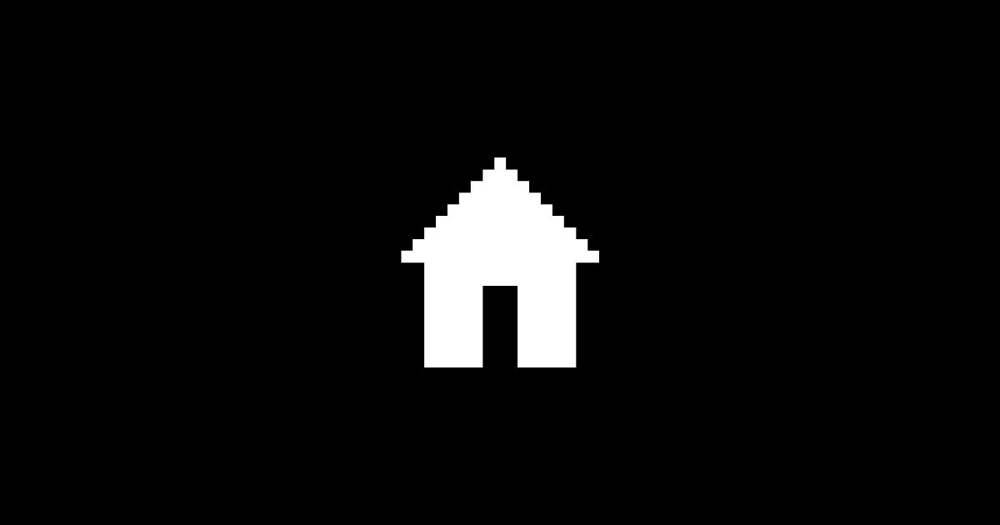

How many places have I carved out for myself on the Internet? I must have set up 20+ spots since I first started logging into AOL at the age of 11. It started out with newsletters painstakingly designed and sent out via AOL Zine World, documenting my banal preteen loves, from my favorite Backstreet Boy (Nick, I'll have you know) to awful makeup tips; then it was Geocities, then my Livejournal and Myspace accounts where I poured my heart out inappropriately. Staking my claim. Declaring that I existed, that I had thoughts and opinions worth putting out there. It felt less scary back then. You were less aware of the rest of the people out there also sending their thoughts out into the electric aether. It wasn't as easy to get singled out. You carved out your little cabin in a hyperlinked forest and sometimes your friends dropped in for coffee . It was nice.

The ubiquotous presence of social media has made it feel a little less cozy out there, though. Your writing doesn't really have a home to call its own: your username is an afterthought, riding the coattails of a bigger company's identity. I appreciate that places like Twitter are phenomenal at getting your name out there and building an audience, but why add the stress of doing that to yourself? Turning yourself into a brand sucks all the joy out of roughin' it on the Internet. It sucks the joy out of art, of creating. I hate it.

> Personal homepages and weblogs have long since faded from the popular trends. They’re no longer hip and nobody’s launching the hot new startup to reinvent them or make them better.  
>
Most of the interest in writing online’s shifted to microblogging, but not everything belongs in 140 characters and it’s all so impermanent. Twitter’s great, but it’s not a replacement for a permanent home that belongs to you.
And since there are fewer and fewer individuals doing long-form writing these days, relative to the growing potential audience, it’s getting easier to get attention than ever if you actually have something original to say. 
> 
Carving out a space for yourself online, somewhere where you can express yourself and share your work, is still one of the best possible investments you can make with your time. It’s why, after ten years, my first response to anyone just getting started online is to start, and maintain, a blog. 
>
-- [Andy Baio](https://waxy.org/2012/04/happy_10th_birthday_waxy/)

This blog is my hypertext bliss station: a space that belongs to *me*. The domain is mine. The files are mine. I will still have all of this text, even if the provider that makes all of *this* possible shuts down (please don't shut down Netlify, I love what you do!).

> You must have a room, or a certain hour or so a day, where you don’t know what was in the newspapers that morning, you don’t know who your friends are, you don’t know what you owe anybody, you don’t know what anybody owes to you. This is a place where you can simply experience and bring forth what you are and what you might be. This is the place of creative incubation. At first you may find that nothing happens there. But if you have a sacred place and use it, something eventually will happen.
>
-- **Joseph Cambell, *The Power of Myth***