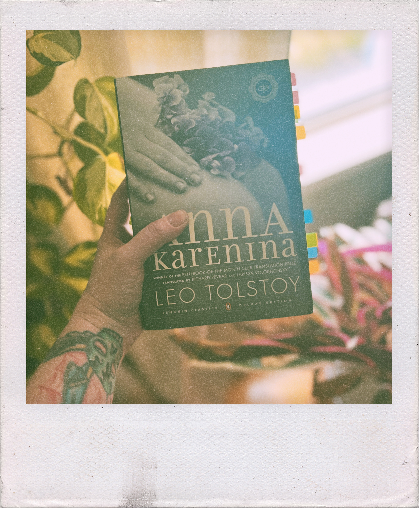

I have been obsessed with the idea of dedicating myself wholly to classic texts lately. Initially, it was the aesthetics appeal to me. I imagine myself an an oversize sweater, a cup of Earl Grey next to me, sitting on ancient couch in front of a roaring fire, a copy of _War and Peace_ in my lap. It’s a comforting image. Like a favorite childhood stuffy, or a pacifier. It’s relaxing. It’s peaceful. It’s the opposite of everything I am right now. And right now, what I am is perpetually wound up, with my face buried in my phone. Depressed. Anxious. Willingly drowning myself in one piece of bad news after another. It’s sad. It reeks of a lack of willpower and discipline. Of control.

But there is something _noble_ about being a bookworm and an intellectual. You’re not sucked into the drama and dopamine rushes of social media. You’re above that sort of vanity and all that pettiness. You just want to sit and wrestle with high-minded ideas and philosophy while those _other_ people squabble over scraps.  

Maybe I just want to exchange one coping mechanism for another. 

So I’ve been wrestling all year trying to force myself to read _something_ old. Something that would be approved by Harold Bloom. Something written before the 1900s. Something with a film adaptation starring Kierra Knightley. 

It has been really, really difficult to do this. 

And it’s not because I find these books boring. I’ve loved every single one that I’ve picked up and abandoned. Michel de Montaigne’s _The Complete Essays_ is extremely poignant and funny and brilliant. _Anna Karenina_ has beautifully tragic and complex characters. **I genuinely love these books!** So why I am struggling so much with them? Why are they such a goddamn chore? 

And if they’re such a chore, despite how much I enjoy them during the 10-minute spurts of reading that I manage, then why am I banging my head against them?

Austin Kleon has always been adament about putting down books you’re struggling with. Per a recent newsletter:

> If you aren’t getting anything out of a book, put it down and pick up another book. Every hour you spend inching through a boring book is an hour you could’ve spent plowing through a brilliant one.
> When it comes to books, quitters finish more. — Austin Kleon, [Read Like An Artist](https://austinkleon.substack.com/p/how-to-read-like-an-artist)

But what do you do if you love the book, and the struggle is not an issue of boredom, but with how your own dumbass brain is wired? Really, it’s more about how I’ve re-wired my brain, thanks to the insidious nature of the likes of Twitter and Reddit, where dopamine hits come in small, bite-sized pieces and my brain is rewarded in 240 characters, rather than 50 pages. The likes of Tolstoy cannot compete with the drama of Twitter. My brain wants what it wants, and I _hate_ what it wants. 

And it’s why I keep forcing myself to sit down with these slow, awkward books, with their archaic English and odd sentence structure. I’m not trying to punish myself, I swear I’m not! There is value in letting the waves of these dusty old tomes crash over me again, and again, and again…right? There is something to be said for letting myself struggle, rather than taking the easy way out. 

From Alan Jacob’s _Breaking Bread With the Dead_:

> Tony Tost…is especially concerned with the effects of presentism on children, and thinks that we ought to make them watch stuff not made for them, not marketed to them, not fired like an arrow at their amygdalae: “Older and adult art forces them to get out of their comfort zone and deal with a little ambiguity and thematic density and encounter shit that wasn’t manufactured for their immediate effortless consumption.”
> …Tost continues, “I’m afraid we’re producing emptier, more fragile, less intellectually and aesthetically adventurous adults.” [^1]

Presentism is this idea that we might be spending a little _too_ much time in the present. We only live in this moment, and as a consequence we have no real values to call our own, our opinion swings wildly to and fro depending on whatever the 24-hour news cycle is telling us to be pissed off about. It also involves a tendency to interpret the past through the lens of modern values and concepts, ignoring the context of said events. We like what we’re told to like, think what we’re told to think, and our values shift with the weather… and we give it very little thought as we continue to feed the algorithms that keeps us inside these bubbles. There’s no thought—just mindless consumption.  There is no _personal density_, no opportunity to develop our own sense of taste. 

> “Personal density,” Kurt Mondaugen in his Peenemünde office not too many steps away from here, enunciating the Law which will one day bear his name, “is directly proportional to temporal bandwidth.” “Temporal bandwidth” is the width of your present, your now. . . . The more you dwell in the past and in the future, the thicker your bandwidth, the more solid your persona. But the narrower your sense of Now, the more tenuous you are. It may get to where you’re having trouble remembering what you were doing five minutes ago. — Thomas Pynchon, _Gravity’s Rainbow_

Alan Jacobs argues that we can begin to build up our personal density by wrestling with the minds of the past, by “breaking bread with the dead.” Not only because these minds are incredibly bright, but because “they are completely alien to us, they are not a part of our habitual round. They draw us out of our daily, our endless cyclical,  obsessions.” 

I am still trying. I have put Montaigne to the side for now. However, as of today, ([[June 1, 2022]]), I’m about ¼ of the way through _Anna Karenina_. This is actually my second stab at this book, and thankfully during my first round I had attempted to highlight and annotate, so I’ve been rediscovering myself while simultaneously rediscovering this book. I highlighted a lot of stuff that is absolutely meaningless to me now. I always had a bad habit of highlighting stuff and not really doing anything about it, and that’s something I’ve been trying to be better about. I told myself I wouldn’t underline something without making a note about it: why I highlighted, my reaction to it, whatever. Enough to give it context should I come across it again. It’s too easy to highlight and slap down page markers—it makes you feel incredibly industrious without actually accomplishing anything. A nasty habit. 

✽

Was writing in my journal about my struggles with reading and writing this morning, and something that dawned on me is that reading or writing in my diary are both meditation practices in and of themselves. Whether sitting on my meditation cushion or trying to read/write, the goal is the same: to not let my endlessly chattering monkey mind get the best of me. To not let my thoughts hook me and drag me away from myself. To let the thoughts linger by, to acknowledge them and then go back to my focus, be it my breath or reading the next paragraph or writing the next sentence. I think this is a good way to frame it. A good approach. Something to think about next time I pick up my book.

[^1]:  In case I’m not the only one who didn’t know: Tony Tost is a director, screenwriter, critic and poet. What a list! I love me a good polymath.